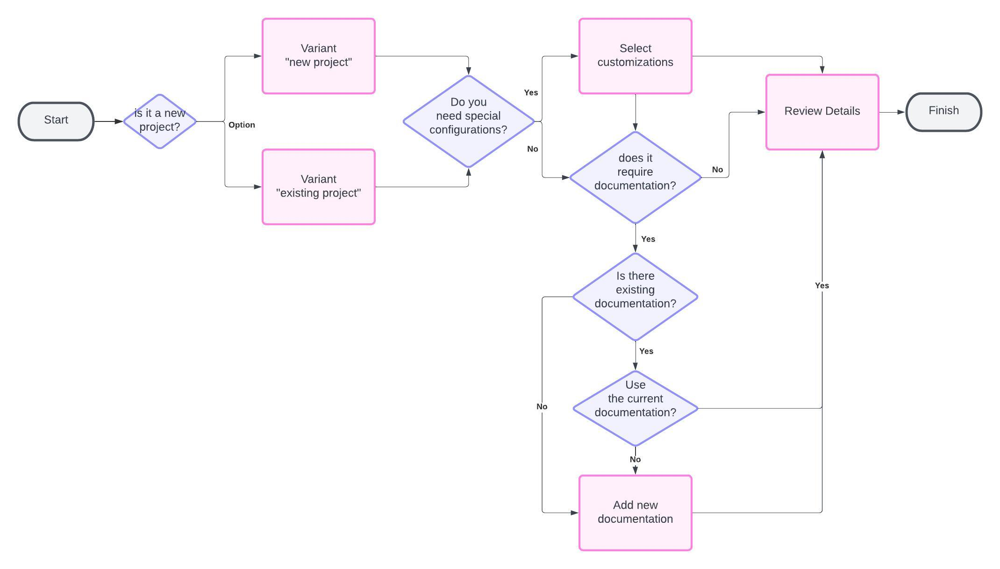
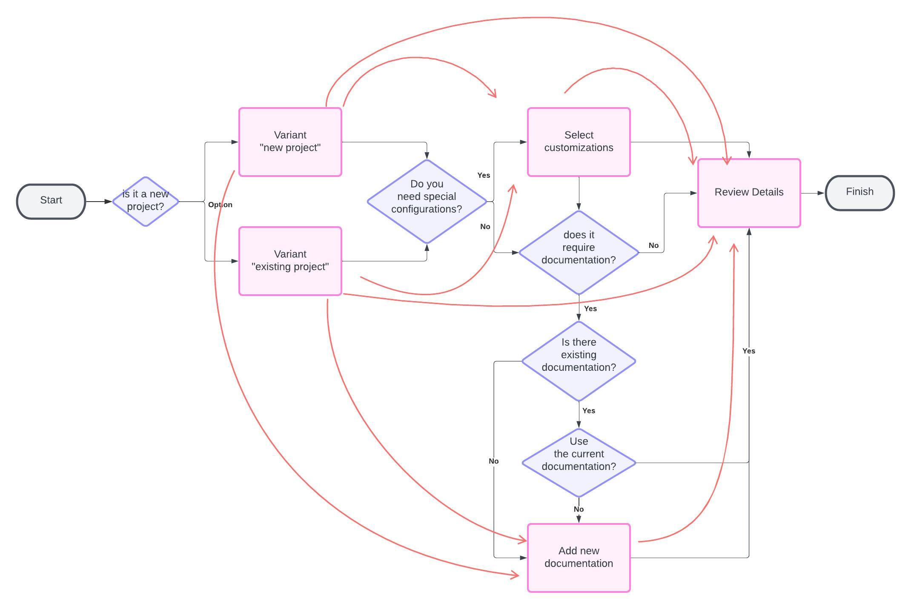

# Performant React Form Wizard with Stepped Navigation

## About
A solution for multi-step wizards with conditional steps. Built in React with ❤️.

## Deployed Site
Deployed Site: https://jonatankruszewski.github.io/React-Form-Wizard/

## Motivation
Allows the creation of a form wizard with multiple steps, each with its own validation rules and conditional rendering.
The wizard is built with a single state object that is passed down to each step, allowing for easy access to the form data and validation rules.

It allows from linear flows, to complex conditional flows, with the ability to skip steps based on the user's input.
For example, it can cover uses cases as the diagram shown below:

If that flow were built as a stand alone were each component redirects to the next step, it would be a nightmare to maintain and understand the flow:

But, using the wizard, the flow is much more clear and easy to maintain:

Disclaimer: The diagrams are educational and for illustrative purposes only. They don't represent the actual implementation of the wizard in this repository or a real flow.

